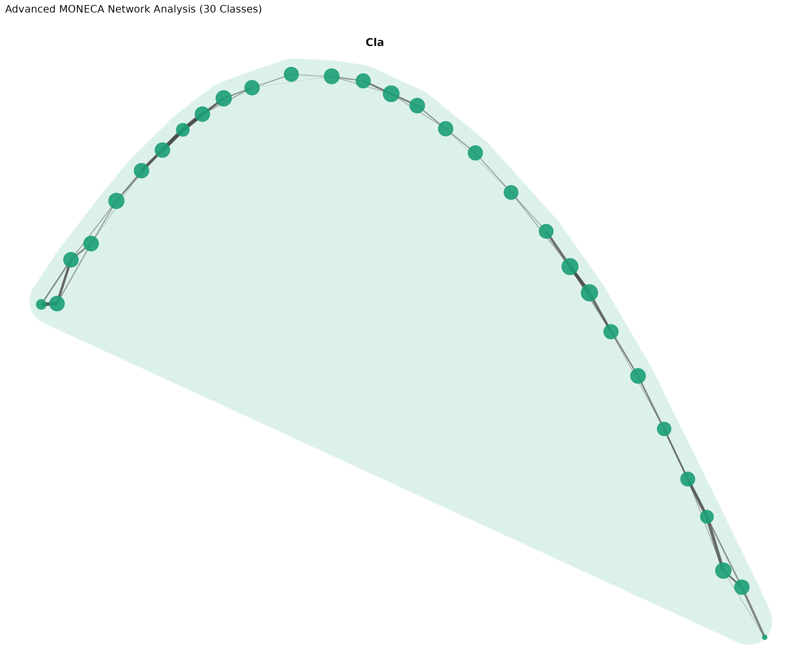
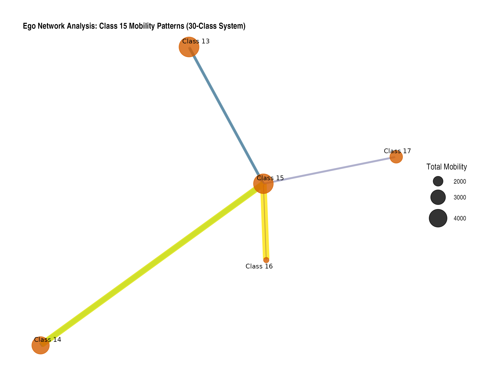
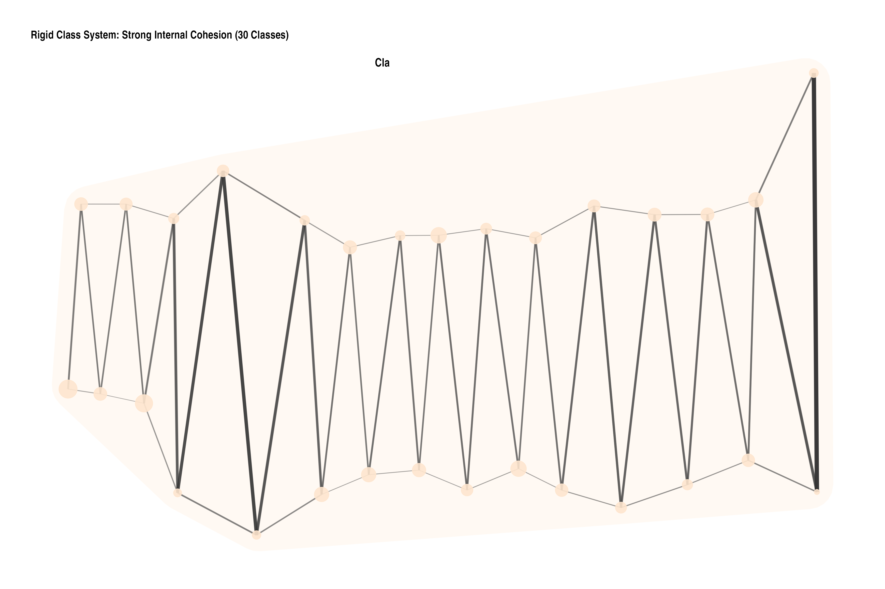
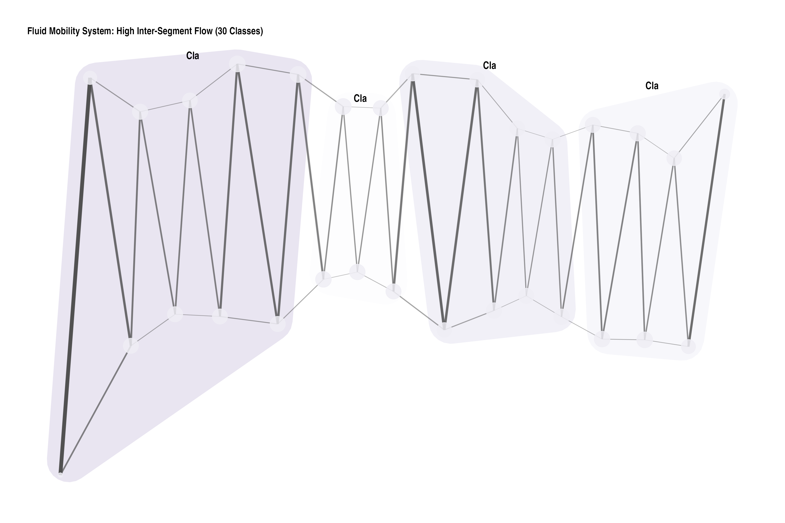
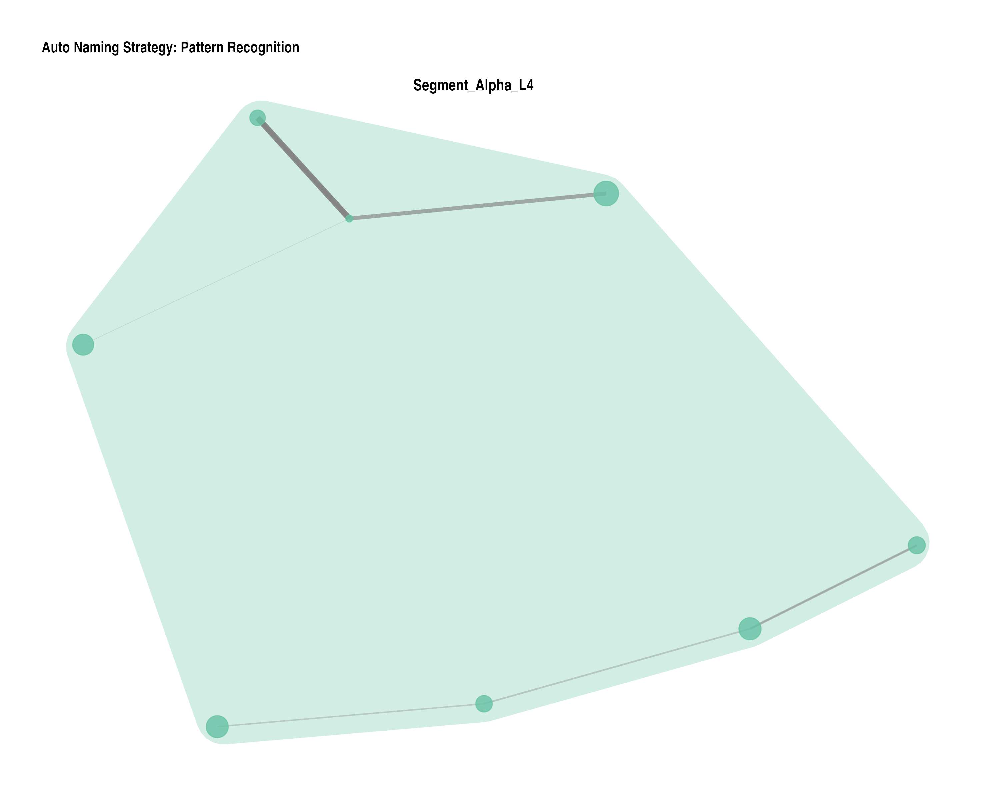
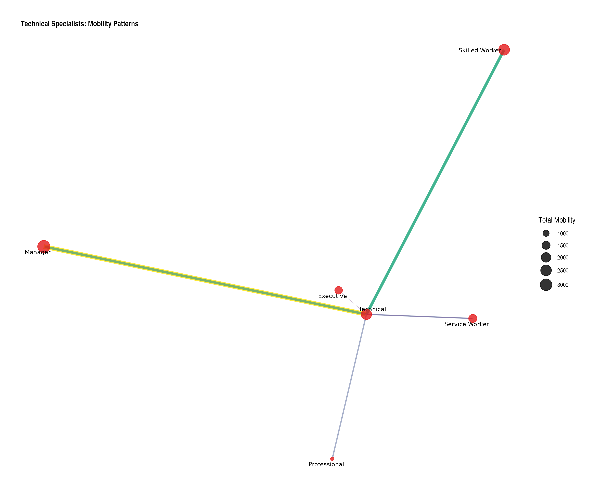
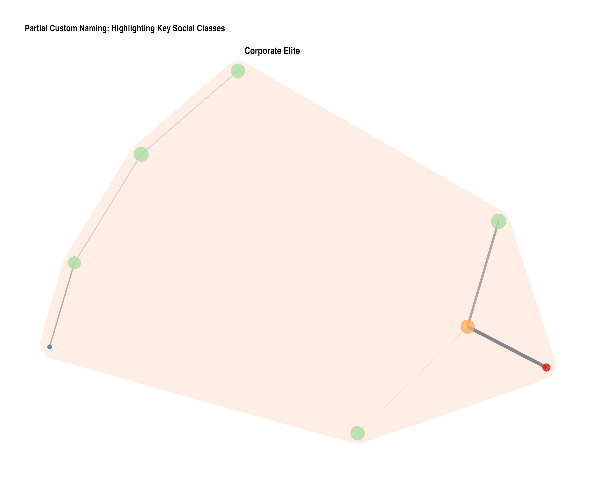
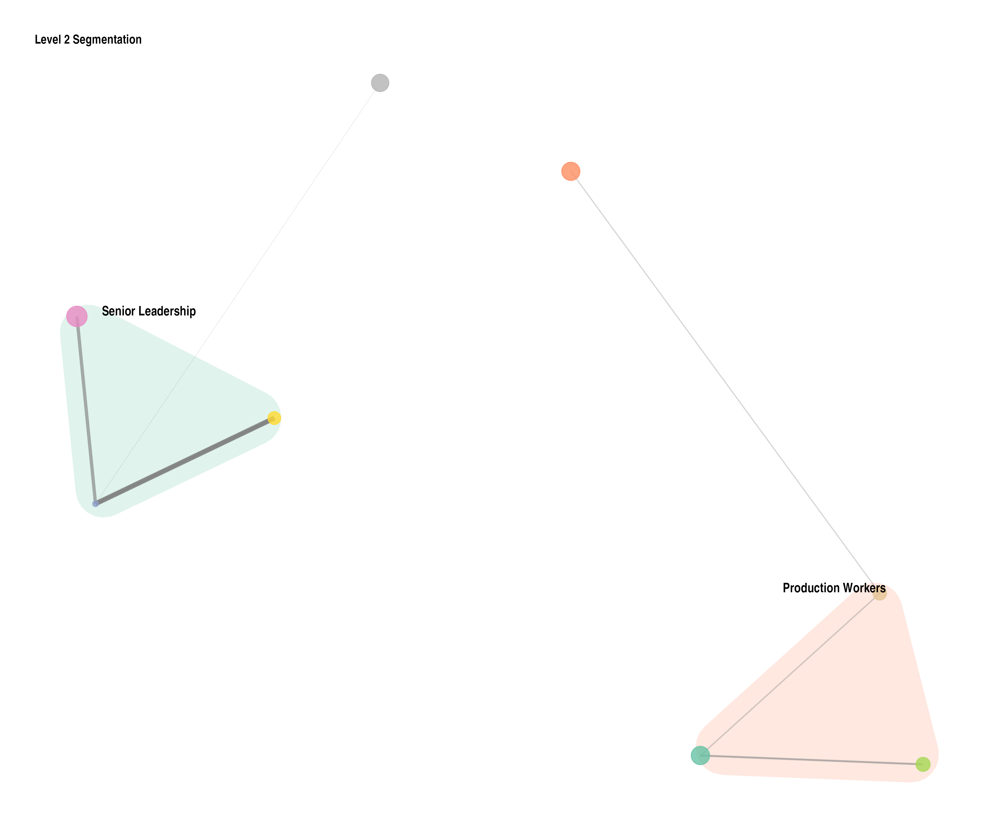

# Introduction to moneca: Mobility Network Clustering Analysis

## Introduction

moneca (Mobility Network Clustering Analysis) is an R package that
analyzes social mobility patterns through graph-theoretic approaches.
The package creates weighted networks from mobility tables and uses
cliques to identify discrete and nested clusters of positions with high
internal mobility.

### About This Vignette

This vignette was written by **Giampaolo Montaletti** as part of the
comprehensive modernization of the moneca package (2024). It provides a
complete guide to using the modern features and capabilities of the
package, including the new visualization system, synthetic data
generation, and enhanced analysis tools.

### Package Background

The **moneca** package (lowercase) is a complete rewrite and
modernization of the original MONECA package. While it implements the
clustering algorithm originally developed by Touboel & Larsen (2017),
the current package features entirely new code for visualization,
testing, data generation, and documentation authored by Giampaolo
Montaletti.

### Key Features

- **Network-based clustering** of mobility tables
- **Hierarchical segmentation** at multiple levels
- **Modern visualization** with ggplot2 and ggraph
- **Quality metrics** for assessing segmentation performance
- **Synthetic data generation** for testing and demonstrations

## Basic Concepts

Social mobility can be represented as a network where:

- **Nodes** represent social positions (occupations, classes, etc.)
- **Edges** represent mobility flows between positions
- **Edge weights** represent the strength of mobility connections
- **Clusters** represent groups of positions with high internal mobility

MONECA identifies these clusters by:

1.  Converting mobility tables to relative risk matrices
2.  Finding cliques in the weighted network
3.  Iteratively aggregating positions into segments
4.  Creating hierarchical segmentation levels

## Installation and Setup

``` r
# Install from GitHub
devtools::install_github("gmontaletti/moneca")

# Load the package
library(moneca)

# Load additional packages for visualization
library(ggplot2)
library(ggraph)
```

## Working with Synthetic Data

MONECA includes functions to generate synthetic mobility data for
demonstrations and testing.

### Creating Basic Synthetic Data

``` r
# Generate a large 30-class mobility table for better statistical analysis
basic_data <- generate_mobility_data(
  n_classes = 30,
  n_total = 50000,  # Larger population for better statistical power
  immobility_strength = 0.7,
  class_clustering = 0.2,
  class_names = paste("Class", sprintf("%02d", 1:30)),
  seed = 42
)

# View a subset of the structure to show key portions
cat("Mobility matrix dimensions:", dim(basic_data), "\n")
#> Mobility matrix dimensions: 31 31
cat("Total population:", basic_data[31, 31], "\n\n")
#> Total population: 50000

# Show first 8x8 corner with totals to demonstrate structure
cat("First 8x8 corner of mobility matrix with marginal totals:\n")
#> First 8x8 corner of mobility matrix with marginal totals:
subset_matrix <- basic_data[c(1:8, 31), c(1:8, 31)]
print(subset_matrix)
#>          Class 01 Class 02 Class 03 Class 04 Class 05 Class 06 Class 07
#> Class 01     2377      388      156       11       14        7       11
#> Class 02       78      500       78       41        8        3        7
#> Class 03       73      140      855      141       57        2        5
#> Class 04        3       20       26      266       39       16        1
#> Class 05        2        2       65      121      785       95       52
#> Class 06        1        1        6       22       72      465       60
#> Class 07       19       12        8        9      239      434     2793
#> Class 08        3        1        3        5        3       54      118
#> Total        2667     1189     1303      742     1313     1199     3178
#>          Class 08 Total
#> Class 01        7  3231
#> Class 02        2   782
#> Class 03        4  1374
#> Class 04        2   398
#> Class 05        2  1210
#> Class 06       25   707
#> Class 07      395  4399
#> Class 08      809  1255
#> Total        1411 50000

# Show diagonal (immobility) for first 10 classes
cat("\nImmobility rates for first 10 classes:\n")
#> 
#> Immobility rates for first 10 classes:
diagonal_values <- diag(basic_data[1:30, 1:30])[1:10]
row_totals <- basic_data[1:10, 31]
immobility_rates <- round(diagonal_values / row_totals * 100, 1)
names(immobility_rates) <- paste("Class", sprintf("%02d", 1:10))
print(immobility_rates)
#> Class 01 Class 02 Class 03 Class 04 Class 05 Class 06 Class 07 Class 08 
#>     73.6     63.9     62.2     66.8     64.9     65.8     63.5     64.5 
#> Class 09 Class 10 
#>     60.1     60.7
```

The mobility matrix shows: - **Rows**: Origin classes (where people
start) - **Columns**: Destination classes (where people end up) - **Last
row/column**: Marginal totals - **Diagonal**: Immobility (staying in
same class)

### Creating Different Mobility Scenarios

``` r
# Create example datasets with different mobility patterns
# Using generate_mobility_data() with different parameters

# For demonstration of larger networks, create custom 30x30 examples
cat("Creating custom 30x30 examples for comparison:\\n")
#> Creating custom 30x30 examples for comparison:\n

# Create 30x30 rigid system
examples_30x30 <- list()
examples_30x30$rigid <- generate_mobility_data(
  n_classes = 30,
  n_total = 45000,
  immobility_strength = 0.85,  # Very rigid
  class_clustering = 0.9,
  class_names = paste("Class", sprintf("%02d", 1:30)),
  seed = 100
)

# Create 30x30 fluid system
examples_30x30$fluid <- generate_mobility_data(
  n_classes = 30,
  n_total = 45000,
  immobility_strength = 0.4,  # Very fluid
  class_clustering = 0.6,
  class_names = paste("Class", sprintf("%02d", 1:30)),
  seed = 200
)

# Examine the rigid class system - show key portions
cat("Rigid class system (30x30 matrix):\n")
#> Rigid class system (30x30 matrix):
cat("Matrix dimensions:", dim(examples_30x30$rigid), "\n")
#> Matrix dimensions: 31 31
cat("Total population:", examples_30x30$rigid[31, 31], "\n\n")
#> Total population: 45000

# Show first 6x6 corner with totals
cat("First 6x6 corner with marginal totals:\n")
#> First 6x6 corner with marginal totals:
rigid_subset <- examples_30x30$rigid[c(1:6, 31), c(1:6, 31)]
print(rigid_subset)
#>          Class 01 Class 02 Class 03 Class 04 Class 05 Class 06 Total
#> Class 01      435      239      122        1        2        0   848
#> Class 02       28       63       39       21        0        1   164
#> Class 03      238      479      926      480      234        1  2448
#> Class 04        4      144      287      543      279      142  1448
#> Class 05        2        3      153      339      632      328  1685
#> Class 06        3        0        5       84      149      292   767
#> Total         768      976     1603     1521     1520     1275 45000

# Show immobility rates for first 8 classes
cat("\nImmobility rates (%) for first 8 classes in rigid system:\n")
#> 
#> Immobility rates (%) for first 8 classes in rigid system:
rigid_diag <- diag(examples_30x30$rigid[1:30, 1:30])[1:8]
rigid_totals <- examples_30x30$rigid[1:8, 31]
rigid_rates <- round(rigid_diag / rigid_totals * 100, 1)
names(rigid_rates) <- paste("Class", sprintf("%02d", 1:8))
print(rigid_rates)
#> Class 01 Class 02 Class 03 Class 04 Class 05 Class 06 Class 07 Class 08 
#>     51.3     38.4     37.8     37.5     37.5     38.1     36.6     36.5

# Examine the fluid (highly mobile) system
cat("\nFluid mobility system (30x30 matrix):\n")
#> 
#> Fluid mobility system (30x30 matrix):
cat("Matrix dimensions:", dim(examples_30x30$fluid), "\n")
#> Matrix dimensions: 31 31
cat("Total population:", examples_30x30$fluid[31, 31], "\n\n")
#> Total population: 45000

# Show first 6x6 corner with totals
cat("First 6x6 corner with marginal totals:\n")
#> First 6x6 corner with marginal totals:
fluid_subset <- examples_30x30$fluid[c(1:6, 31), c(1:6, 31)]
print(fluid_subset)
#>          Class 01 Class 02 Class 03 Class 04 Class 05 Class 06 Total
#> Class 01      599      508      220        7        8        3  1448
#> Class 02      381      517      381      192        8        1  1597
#> Class 03      209      372      564      394      203        7  1853
#> Class 04        3      230      435      546      455      237  2017
#> Class 05        0        4      141      320      400      281  1404
#> Class 06        3        2        2      125      295      336  1216
#> Total        1285     1710     1821     1662     1632     1424 45000

# Show immobility rates for first 8 classes
cat("\nImmobility rates (%) for first 8 classes in fluid system:\n")
#> 
#> Immobility rates (%) for first 8 classes in fluid system:
fluid_diag <- diag(examples_30x30$fluid[1:30, 1:30])[1:8]
fluid_totals <- examples_30x30$fluid[1:8, 31]
fluid_rates <- round(fluid_diag / fluid_totals * 100, 1)
names(fluid_rates) <- paste("Class", sprintf("%02d", 1:8))
print(fluid_rates)
#> Class 01 Class 02 Class 03 Class 04 Class 05 Class 06 Class 07 Class 08 
#>     41.4     32.4     30.4     27.1     28.5     27.6     29.0     27.8
```

## Running MONECA Analysis

### Basic Analysis

``` r
# Run MONECA on the basic dataset
seg <- moneca(basic_data, segment.levels = 3)
#>   |                                                                              |                                                                      |   0%  |                                                                              |=                                                                     |   2%  |                                                                              |==                                                                    |   3%  |                                                                              |====                                                                  |   5%  |                                                                              |=====                                                                 |   7%  |                                                                              |======                                                                |   9%  |                                                                              |=======                                                               |  10%  |                                                                              |========                                                              |  12%  |                                                                              |==========                                                            |  14%  |                                                                              |===========                                                           |  16%  |                                                                              |============                                                          |  17%  |                                                                              |=============                                                         |  19%  |                                                                              |==============                                                        |  21%  |                                                                              |================                                                      |  22%  |                                                                              |=================                                                     |  24%
#> 25% ready!
#>   |                                                                              |==================                                                    |  26%  |                                                                              |===================                                                   |  28%  |                                                                              |=====================                                                 |  29%  |                                                                              |======================                                                |  31%  |                                                                              |=======================                                               |  33%  |                                                                              |========================                                              |  34%  |                                                                              |=========================                                             |  36%  |                                                                              |===========================                                           |  38%  |                                                                              |============================                                          |  40%  |                                                                              |=============================                                         |  41%  |                                                                              |==============================                                        |  43%  |                                                                              |===============================                                       |  45%  |                                                                              |=================================                                     |  47%  |                                                                              |==================================                                    |  48%  |                                                                              |===================================                                   |  50%
#> 51% ready!
#>   |                                                                              |====================================                                  |  52%  |                                                                              |=====================================                                 |  53%  |                                                                              |=======================================                               |  55%  |                                                                              |========================================                              |  57%  |                                                                              |=========================================                             |  59%  |                                                                              |==========================================                            |  60%  |                                                                              |===========================================                           |  62%  |                                                                              |=============================================                         |  64%  |                                                                              |==============================================                        |  66%  |                                                                              |===============================================                       |  67%  |                                                                              |================================================                      |  69%  |                                                                              |=================================================                     |  71%  |                                                                              |===================================================                   |  72%  |                                                                              |====================================================                  |  74%
#> 75% ready!
#>   |                                                                              |=====================================================                 |  76%  |                                                                              |======================================================                |  78%  |                                                                              |========================================================              |  79%  |                                                                              |=========================================================             |  81%  |                                                                              |==========================================================            |  83%  |                                                                              |===========================================================           |  84%  |                                                                              |============================================================          |  86%  |                                                                              |==============================================================        |  88%  |                                                                              |===============================================================       |  90%  |                                                                              |================================================================      |  91%  |                                                                              |=================================================================     |  93%  |                                                                              |==================================================================    |  95%  |                                                                              |====================================================================  |  97%  |                                                                              |===================================================================== |  98%  |                                                                              |======================================================================| 100%
#> 100% ready!
#> 
#>   |                                                                              |                                                                      |   0%  |                                                                              |=======                                                               |  10%  |                                                                              |==============                                                        |  20%
#> 27% ready!
#>   |                                                                              |=====================                                                 |  30%  |                                                                              |============================                                          |  40%  |                                                                              |===================================                                   |  50%
#> 55% ready!
#>   |                                                                              |==========================================                            |  60%  |                                                                              |=================================================                     |  70%  |                                                                              |========================================================              |  80%
#> 82% ready!
#>   |                                                                              |===============================================================       |  90%  |                                                                              |======================================================================| 100%
#> 100% ready!

# View the results
print(seg)
#> 
#> ================================================================================
#>                         moneca MOBILITY ANALYSIS RESULTS                        
#> ================================================================================
#> 
#> OVERALL MOBILITY PATTERNS
#> -------------------------------------------------------------------------------
#> Overall Population Mobility Rate:                    35.4%
#> Average Mobility Concentration (all levels):         90.9%
#> 
#> HIERARCHICAL SEGMENTATION ANALYSIS
#> -------------------------------------------------------------------------------
#> 
#> Internal Mobility Within Segments (%):
#> Level 1 Level 2 Level 3 Level 4 
#>    64.6    76.8    85.3   100.0 
#> 
#> Mobility Concentration in Significant Pathways by Level (%):
#> Level 1 Level 2 Level 3 Level 4 
#>    91.0    87.4    85.3   100.0 
#> 
#> Network Structure by Level:
#>                                    Level 1      Level 2      Level 3      Level 4 
#> -------------------------------------------------------------------------------
#> Active Segments/Classes:                30           12            6            1 
#> Significant Edges:                     104           12            0            0 
#> Network Density:                     0.120        0.091        0.000          NaN 
#> Isolated Segments:                       0            0            6            1 
#> 
#> DETAILED WEIGHTED DEGREE DISTRIBUTIONS (STRENGTH)
#> -------------------------------------------------------------------------------
#> 
#> Total Weighted Connections (Strength In + Out):
#>          Min    Q1 Median  Mean    Q3   Max
#> Level 1 8.77 15.32  20.14 20.55 25.81 39.11
#> Level 2 1.07  2.03   2.57  2.75  3.25  5.56
#> Level 3 0.00  0.00   0.00  0.00  0.00  0.00
#> Level 4 0.00  0.00   0.00  0.00  0.00  0.00
#> 
#> Outward Mobility Strength (Weighted Out-Degree):
#>          Min   Q1 Median  Mean    Q3   Max
#> Level 1 5.36 7.81  10.64 10.27 12.05 15.58
#> Level 2 0.00 0.00   1.14  1.37  2.67  3.31
#> Level 3 0.00 0.00   0.00  0.00  0.00  0.00
#> Level 4 0.00 0.00   0.00  0.00  0.00  0.00
#> 
#> Inward Mobility Strength (Weighted In-Degree):
#>          Min   Q1 Median  Mean    Q3   Max
#> Level 1 1.87 6.55   9.69 10.27 14.24 26.51
#> Level 2 0.00 0.78   1.12  1.37  1.71  4.39
#> Level 3 0.00 0.00   0.00  0.00  0.00  0.00
#> Level 4 0.00 0.00   0.00  0.00  0.00  0.00
#> 
#> Edge Weight Distribution (Relative Risk Values):
#>          Min   Q1 Median Mean   Q3  Max
#> Level 1 1.02 1.61   2.42 2.96 3.76 8.35
#> Level 2 1.04 1.07   1.16 1.37 1.51 2.23
#> Level 3   NA   NA     NA  NaN   NA   NA
#> Level 4   NA   NA     NA  NaN   NA   NA
#> 
#> ================================================================================
```

The MONECA object contains: - `segment.list`: Hierarchical clusters for
each level - `mat.list`: Aggregated mobility matrices for each level

### Understanding the Results

``` r
# View segment membership
membership <- segment.membership(seg)
cat("Segment membership summary:\n")
#> Segment membership summary:
cat("Number of levels:", length(membership), "\n")
#> Number of levels: 2
for(i in 1:length(membership)) {
  cat("Level", i, "- Number of segments:", length(unique(membership[[i]])), "\n")
}
#> Level 1 - Number of segments: 30 
#> Level 2 - Number of segments: 1

# Show first 15 class memberships at each level
cat("\nSegment membership for first 15 classes:\n")
#> 
#> Segment membership for first 15 classes:
membership_subset <- data.frame(
  Class = paste("Class", sprintf("%02d", 1:15)),
  Level_1 = membership[[1]][1:15],
  Level_2 = membership[[2]][1:15]
)
if(length(membership) >= 3) {
  membership_subset$Level_3 <- membership[[3]][1:15]
}
print(membership_subset)
#>       Class  Level_1 Level_2
#> 1  Class 01 Class 01     4.1
#> 2  Class 02 Class 02     4.1
#> 3  Class 03 Class 03     4.1
#> 4  Class 04 Class 04     4.1
#> 5  Class 05 Class 05     4.1
#> 6  Class 06 Class 06     4.1
#> 7  Class 07 Class 07     4.1
#> 8  Class 08 Class 08     4.1
#> 9  Class 09 Class 09     4.1
#> 10 Class 10 Class 10     4.1
#> 11 Class 11 Class 11     4.1
#> 12 Class 12 Class 12     4.1
#> 13 Class 13 Class 13     4.1
#> 14 Class 14 Class 14     4.1
#> 15 Class 15 Class 15     4.1

# View the aggregated matrix for level 2
cat("\nLevel 2 aggregated matrix dimensions:", dim(seg$mat.list[[2]]), "\n")
#> 
#> Level 2 aggregated matrix dimensions: 13 13
print("Level 2 aggregated matrix:")
#> [1] "Level 2 aggregated matrix:"
print(seg$mat.list[[2]])
#>       1    2    3    4    5    6    7    8    9   10   11   12    31
#> 1  1203   15   12   15   14    6    9  149   82   12    6    7  1530
#> 2    21 1688   22   16   16   15   20   19  177   22    5    7  2028
#> 3    21   10 1516   16   16    6  196   28   25   25   46    6  1911
#> 4    22   32   26 2355   28  240  171   30   39   20   15    4  2982
#> 5    42   45   32   47 3257   23   21   92   53  420   10  129  4171
#> 6    51   37   46  308   47 3343   28   42   37   43   12   19  4013
#> 7    41   49  680  356   36   33 3752   42   39   42   21   15  5106
#> 8   397   62   60   66  225   46   47 5715   78   75   30  442  7243
#> 9   452  523   64   64   58   40   54   52 5303   82   16   19  6727
#> 10   65   71  173   58  424   43   38   70   51 5567  342   26  6928
#> 11   32   30  431   23   22   25   15   21   20  456 2036   12  3123
#> 12   59   48   29   34  629   36   26  609   42   34   14 2678  4238
#> 31 2406 2610 3091 3358 4772 3856 4377 6869 5946 6798 2553 3364 50000
```

## Modern Visualization with ggraph

MONECA now includes modern visualization functions using ggplot2 and
ggraph, designed with accessibility and clarity as primary concerns.

### Visualization Design Principles

All MONECA plotting functions follow evidence-based design principles
for maximum accessibility and clarity:

1.  **Colorblind Accessibility**: Uses viridis, plasma, and ColorBrewer
    palettes that are perceptually uniform and distinguishable for all
    types of color vision
2.  **High Contrast**: Maintains WCAG AA contrast ratios for text and
    visual elements
3.  **Redundant Encoding**: Uses both color and other visual properties
    (size, shape, position) to encode information
4.  **Clear Visual Hierarchy**: Guides attention through strategic use
    of size, transparency, and positioning
5.  **Minimal Cognitive Load**: Reduces visual clutter while maintaining
    analytical depth

``` r
# Example of accessibility-focused plotting
plot_moneca_ggraph(
  seg,
  color_palette = "Set2",       # Colorblind-safe qualitative palette
  node_alpha = 0.85,            # High contrast
  edge_alpha = 0.6,             # Balanced visibility
  show_segments = TRUE,         # Visual grouping
  segment_alpha = 0.2,          # Subtle boundaries
  label_size = 3.5              # Readable text
)

# For continuous variables, use viridis family
plot_moneca_ggraph(
  seg,
  node_color = "mobility",      # Color by mobility rates
  color_palette = "viridis",    # Colorblind-safe continuous scale
  node_alpha = 0.85,
  edge_alpha = 0.6
)
```

### Basic Network Plot with Colorblind-Friendly Design

``` r
# Create a basic network plot with improved accessibility
# Using viridis color palette (colorblind-friendly) and optimized layout
# Note: Node colors represent segment membership, sizes show total mobility
p1 <- plot_moneca_ggraph(
  seg,
  title = "Social Mobility Network: Hierarchical Segmentation",
  layout = "stress",  # Better layout for clear network structure
  node_color = "segment",
  node_size = "total",
  color_palette = "Set2",  # Colorblind-friendly palette
  node_alpha = 0.85,
  edge_alpha = 0.7,
  show_segments = TRUE,
  segment_alpha = 0.2,
  label_size = 3.5
)

print(p1)
```


### Advanced Network Visualization with Clear Segment Boundaries

``` r
# Create an advanced plot emphasizing segment structure for 30-node network
# Note: For larger networks, reduce label clutter and focus on structure
p2 <- plot_moneca_ggraph(
  seg,
  layout = "fr",  # Force-directed layout for balanced positioning
  node_color = "segment",
  node_size = "mobility",  # Size by mobility rate for analytical insight
  edge_width = "weight",
  color_palette = "Dark2",  # High-contrast ColorBrewer palette
  edge_color = "grey30",  # Darker edges for better visibility
  theme_style = "minimal",
  title = "Advanced MONECA Network Analysis (30 Classes)",
  show_labels = FALSE,  # Turn off labels for 30-node network to reduce clutter
  show_segments = TRUE,
  segment_alpha = 0.15,
  node_alpha = 0.9,
  edge_alpha = 0.6
)

print(p2)
```



``` r

# Also create a subset visualization focusing on the largest segments
cat("\nLargest segments at Level 2:\n")
#> 
#> Largest segments at Level 2:
level2_segments <- seg$segment.list[[2]]
segment_sizes <- sapply(level2_segments, length)
largest_segments <- order(segment_sizes, decreasing = TRUE)[1:3]
cat("Segment sizes:", segment_sizes[largest_segments], "\n")
#> Segment sizes: 3 3 3
```

### Ego Network Analysis: Focus on Individual Position Dynamics

Ego networks reveal mobility patterns from a single focal position,
showing both incoming and outgoing flows:

``` r
# Create ego network for class 15 (middle of the range) with enhanced accessibility
# Note: Red nodes show focal position and same-segment connections; Flow width indicates volume
p3 <- plot_ego_ggraph(
  seg,
  basic_data,
  ego_id = 15,  # Class 15 out of 30 classes
  layout = "stress",  # Stress layout for cleaner ego networks
  title = "Ego Network Analysis: Class 15 Mobility Patterns (30-Class System)",
  highlight_color = "#D55E00",  # Colorblind-safe orange-red
  flow_color = "plasma",  # Perceptually uniform color scale
  node_size_range = c(3, 12),
  edge_width_range = c(0.5, 4),
  min_weight = 50  # Higher threshold for 30-class system to filter weak connections
)

print(p3)
```



``` r

# Show ego network statistics
cat("\nEgo network statistics for Class 15:\n")
#> 
#> Ego network statistics for Class 15:
ego_connections <- which(basic_data[15, 1:30] > 50 | basic_data[1:30, 15] > 50)
cat("Classes connected to Class 15 (flows > 50):", length(ego_connections), "\n")
#> Classes connected to Class 15 (flows > 50): 5
cat("Connected classes:", paste(ego_connections, collapse = ", "), "\n")
#> Connected classes: 13, 14, 15, 16, 17
```

### Multi-Level Segmentation: Hierarchical Structure Visualization

``` r
# Create stair plots showing progressive segmentation for 30-class system
# Using consistent positioning to track segment evolution across levels
stair_plots <- plot_stair_ggraph(
  seg, 
  levels = 2:3,
  layout = NULL,  # Use consistent layout.matrix for position stability
  segment_naming = "auto",
  color_palette = "Set2",  # Colorblind-friendly qualitative palette
  node_size = "total",
  edge_alpha = 0.6,
  node_alpha = 0.85,
  segment_alpha = 0.2,
  label_size = 2.5  # Smaller labels for 30-node network
)

# Display individual plots with improved spacing
print(stair_plots$`Level 2`)
```


``` r
print(stair_plots$`Level 3`)
```


``` r

# Provide numerical summary of segmentation progression
cat("\nSegmentation progression summary:\n")
#> 
#> Segmentation progression summary:
for(level in 2:3) {
  n_segments <- length(seg$segment.list[[level]])
  avg_size <- mean(sapply(seg$segment.list[[level]], length))
  cat("Level", level, ":", n_segments, "segments, average size", round(avg_size, 1), "classes\n")
}
#> Level 2 : 10 segments, average size 2.8 classes
#> Level 3 : 6 segments, average size 5 classes
```

## Advanced Analysis Examples

### Comparing Different Mobility Regimes

``` r
# Analyze the rigid class system (30x30)
rigid_seg <- moneca(examples_30x30$rigid, segment.levels = 3)
#>   |                                                                              |                                                                      |   0%  |                                                                              |=                                                                     |   2%  |                                                                              |==                                                                    |   4%  |                                                                              |====                                                                  |   5%  |                                                                              |=====                                                                 |   7%  |                                                                              |======                                                                |   9%  |                                                                              |========                                                              |  11%  |                                                                              |=========                                                             |  12%  |                                                                              |==========                                                            |  14%  |                                                                              |===========                                                           |  16%  |                                                                              |============                                                          |  18%  |                                                                              |==============                                                        |  20%  |                                                                              |===============                                                       |  21%  |                                                                              |================                                                      |  23%
#> 25% ready!
#>   |                                                                              |==================                                                    |  25%  |                                                                              |===================                                                   |  27%  |                                                                              |====================                                                  |  29%  |                                                                              |=====================                                                 |  30%  |                                                                              |======================                                                |  32%  |                                                                              |========================                                              |  34%  |                                                                              |=========================                                             |  36%  |                                                                              |==========================                                            |  38%  |                                                                              |============================                                          |  39%  |                                                                              |=============================                                         |  41%  |                                                                              |==============================                                        |  43%  |                                                                              |===============================                                       |  45%  |                                                                              |================================                                      |  46%  |                                                                              |==================================                                    |  48%  |                                                                              |===================================                                   |  50%
#> 51% ready!
#>   |                                                                              |====================================                                  |  52%  |                                                                              |======================================                                |  54%  |                                                                              |=======================================                               |  55%  |                                                                              |========================================                              |  57%  |                                                                              |=========================================                             |  59%  |                                                                              |==========================================                            |  61%  |                                                                              |============================================                          |  62%  |                                                                              |=============================================                         |  64%  |                                                                              |==============================================                        |  66%  |                                                                              |================================================                      |  68%  |                                                                              |=================================================                     |  70%  |                                                                              |==================================================                    |  71%  |                                                                              |===================================================                   |  73%  |                                                                              |====================================================                  |  75%
#> 75% ready!
#>   |                                                                              |======================================================                |  77%  |                                                                              |=======================================================               |  79%  |                                                                              |========================================================              |  80%  |                                                                              |==========================================================            |  82%  |                                                                              |===========================================================           |  84%  |                                                                              |============================================================          |  86%  |                                                                              |=============================================================         |  88%  |                                                                              |==============================================================        |  89%  |                                                                              |================================================================      |  91%  |                                                                              |=================================================================     |  93%  |                                                                              |==================================================================    |  95%  |                                                                              |====================================================================  |  96%  |                                                                              |===================================================================== |  98%  |                                                                              |======================================================================| 100%
#> 100% ready!
#> 
#>   |                                                                              |                                                                      |   0%  |                                                                              |=========                                                             |  12%  |                                                                              |==================                                                    |  25%
#> 33% ready!
#>   |                                                                              |==========================                                            |  38%  |                                                                              |===================================                                   |  50%
#> 56% ready!
#>   |                                                                              |============================================                          |  62%  |                                                                              |====================================================                  |  75%
#> 78% ready!
#>   |                                                                              |=============================================================         |  88%  |                                                                              |======================================================================| 100%
#> 100% ready!

# Analyze the fluid mobility system (30x30)
fluid_seg <- moneca(examples_30x30$fluid, segment.levels = 3)
#>   |                                                                              |                                                                      |   0%  |                                                                              |=                                                                     |   2%  |                                                                              |==                                                                    |   4%  |                                                                              |====                                                                  |   5%  |                                                                              |=====                                                                 |   7%  |                                                                              |======                                                                |   9%  |                                                                              |========                                                              |  11%  |                                                                              |=========                                                             |  12%  |                                                                              |==========                                                            |  14%  |                                                                              |===========                                                           |  16%  |                                                                              |============                                                          |  18%  |                                                                              |==============                                                        |  20%  |                                                                              |===============                                                       |  21%  |                                                                              |================                                                      |  23%
#> 25% ready!
#>   |                                                                              |==================                                                    |  25%  |                                                                              |===================                                                   |  27%  |                                                                              |====================                                                  |  29%  |                                                                              |=====================                                                 |  30%  |                                                                              |======================                                                |  32%  |                                                                              |========================                                              |  34%  |                                                                              |=========================                                             |  36%  |                                                                              |==========================                                            |  38%  |                                                                              |============================                                          |  39%  |                                                                              |=============================                                         |  41%  |                                                                              |==============================                                        |  43%  |                                                                              |===============================                                       |  45%  |                                                                              |================================                                      |  46%  |                                                                              |==================================                                    |  48%  |                                                                              |===================================                                   |  50%
#> 51% ready!
#>   |                                                                              |====================================                                  |  52%  |                                                                              |======================================                                |  54%  |                                                                              |=======================================                               |  55%  |                                                                              |========================================                              |  57%  |                                                                              |=========================================                             |  59%  |                                                                              |==========================================                            |  61%  |                                                                              |============================================                          |  62%  |                                                                              |=============================================                         |  64%  |                                                                              |==============================================                        |  66%  |                                                                              |================================================                      |  68%  |                                                                              |=================================================                     |  70%  |                                                                              |==================================================                    |  71%  |                                                                              |===================================================                   |  73%  |                                                                              |====================================================                  |  75%
#> 75% ready!
#>   |                                                                              |======================================================                |  77%  |                                                                              |=======================================================               |  79%  |                                                                              |========================================================              |  80%  |                                                                              |==========================================================            |  82%  |                                                                              |===========================================================           |  84%  |                                                                              |============================================================          |  86%  |                                                                              |=============================================================         |  88%  |                                                                              |==============================================================        |  89%  |                                                                              |================================================================      |  91%  |                                                                              |=================================================================     |  93%  |                                                                              |==================================================================    |  95%  |                                                                              |====================================================================  |  96%  |                                                                              |===================================================================== |  98%  |                                                                              |======================================================================| 100%
#> 100% ready!
#> 
#>   |                                                                              |                                                                      |   0%  |                                                                              |=======                                                               |  10%  |                                                                              |==============                                                        |  20%
#> 27% ready!
#>   |                                                                              |=====================                                                 |  30%  |                                                                              |============================                                          |  40%  |                                                                              |===================================                                   |  50%
#> 55% ready!
#>   |                                                                              |==========================================                            |  60%  |                                                                              |=================================================                     |  70%  |                                                                              |========================================================              |  80%
#> 82% ready!
#>   |                                                                              |===============================================================       |  90%  |                                                                              |======================================================================| 100%
#> 100% ready!
#> 
#>   |                                                                              |                                                                      |   0%  |                                                                              |==============                                                        |  20%
#> 33% ready!
#>   |                                                                              |============================                                          |  40%
#> 50% ready!
#>   |                                                                              |==========================================                            |  60%  |                                                                              |========================================================              |  80%
#> 83% ready!
#>   |                                                                              |======================================================================| 100%
#> 100% ready!

# Compare segment memberships - show summary statistics
rigid_membership <- segment.membership(rigid_seg)
fluid_membership <- segment.membership(fluid_seg)

cat("Rigid system segmentation summary:\n")
#> Rigid system segmentation summary:
for(i in 1:length(rigid_membership)) {
  n_segments <- length(unique(rigid_membership[[i]]))
  segment_sizes <- table(rigid_membership[[i]])
  avg_size <- mean(segment_sizes)
  max_size <- max(segment_sizes)
  cat("Level", i, ":", n_segments, "segments, avg size", round(avg_size, 1), 
      ", largest segment", max_size, "classes\n")
}
#> Level 1 : 30 segments, avg size 1 , largest segment 1 classes
#> Level 2 : 1 segments, avg size 30 , largest segment 30 classes

cat("\nFluid system segmentation summary:\n")
#> 
#> Fluid system segmentation summary:
for(i in 1:length(fluid_membership)) {
  n_segments <- length(unique(fluid_membership[[i]]))
  segment_sizes <- table(fluid_membership[[i]])
  avg_size <- mean(segment_sizes)
  max_size <- max(segment_sizes)
  cat("Level", i, ":", n_segments, "segments, avg size", round(avg_size, 1), 
      ", largest segment", max_size, "classes\n")
}
#> Level 1 : 30 segments, avg size 1 , largest segment 1 classes
#> Level 2 : 4 segments, avg size 7.5 , largest segment 10 classes

# Show first 12 class memberships for comparison
cat("\nSegment membership comparison for first 12 classes:\n")
#> 
#> Segment membership comparison for first 12 classes:
comparison_df <- data.frame(
  Class = paste("Class", sprintf("%02d", 1:12)),
  Rigid_L2 = rigid_membership[[2]][1:12],
  Fluid_L2 = fluid_membership[[2]][1:12]
)
if(length(rigid_membership) >= 3 && length(fluid_membership) >= 3) {
  comparison_df$Rigid_L3 <- rigid_membership[[3]][1:12]
  comparison_df$Fluid_L3 <- fluid_membership[[3]][1:12]
}
print(comparison_df)
#>       Class Rigid_L2 Fluid_L2
#> 1  Class 01      4.1      4.1
#> 2  Class 02      4.1      4.1
#> 3  Class 03      4.1      4.1
#> 4  Class 04      4.1      4.1
#> 5  Class 05      4.1      4.1
#> 6  Class 06      4.1      4.1
#> 7  Class 07      4.1      4.1
#> 8  Class 08      4.1      4.2
#> 9  Class 09      4.1      4.2
#> 10 Class 10      4.1      4.2
#> 11 Class 11      4.1      4.2
#> 12 Class 12      4.1      4.2
```

### Comparing Mobility Regimes: Accessibility-Focused Visualizations

``` r
# Compare rigid vs fluid systems for 30-class networks
# Using colorblind-safe palettes and clear differentiation

# Plot rigid system - emphasis on strong boundaries
# Note: High immobility rates create distinct, well-separated segments
p_rigid <- plot_moneca_ggraph(
  rigid_seg,
  title = "Rigid Class System: Strong Internal Cohesion (30 Classes)",
  layout = "stress",
  node_color = "segment",
  node_size = "total",
  color_palette = "Oranges",  # Sequential palette for rigid structure
  edge_color = "grey20",
  show_segments = TRUE,
  segment_alpha = 0.25,
  node_alpha = 0.9,
  edge_alpha = 0.5,
  show_labels = FALSE  # No labels for 30-node network
)

# Plot fluid system - emphasis on connectivity
# Note: Strong cross-segment mobility creates overlapping, less distinct boundaries
p_fluid <- plot_moneca_ggraph(
  fluid_seg,
  title = "Fluid Mobility System: High Inter-Segment Flow (30 Classes)",
  layout = "stress",
  node_color = "segment",
  node_size = "mobility",  # Size by mobility rate to show fluidity
  color_palette = "Purples",  # Different sequential palette for contrast
  edge_color = "grey30",
  show_segments = TRUE,
  segment_alpha = 0.15,  # Lower alpha for fluid boundaries
  node_alpha = 0.85,
  edge_alpha = 0.7,  # Higher edge alpha to show connectivity
  show_labels = FALSE  # No labels for 30-node network
)

print(p_rigid)
```



``` r
print(p_fluid)
```



``` r

# Add network density comparison
cat("\nNetwork characteristics comparison:\n")
#> 
#> Network characteristics comparison:
cat("Rigid system - segments at Level 2:", length(rigid_seg$segment.list[[2]]), "\n")
#> Rigid system - segments at Level 2: 10
cat("Fluid system - segments at Level 2:", length(fluid_seg$segment.list[[2]]), "\n")
#> Fluid system - segments at Level 2: 10

# Calculate edge densities
rigid_edges <- sum(!is.na(segment.edges(rigid_seg, level = 1)) & segment.edges(rigid_seg, level = 1) > 1)
fluid_edges <- sum(!is.na(segment.edges(fluid_seg, level = 1)) & segment.edges(fluid_seg, level = 1) > 1)
max_edges <- 30 * 29  # Directed graph

cat("Rigid system edge density:", round(rigid_edges / max_edges * 100, 1), "%\n")
#> Rigid system edge density: 13.1 %
cat("Fluid system edge density:", round(fluid_edges / max_edges * 100, 1), "%\n")
#> Fluid system edge density: 13.1 %
```

### Advanced Visualization Techniques

#### Dendrogram Visualization for Hierarchical Structure

``` r
# Create a dendrogram showing the hierarchical clustering structure
# This provides a clear view of how categories are progressively aggregated
dendro_plot <- plot_moneca_dendrogram(
  seg,
  height_method = "uniform",          # Equal spacing between levels
  color_segments = TRUE,              # Color branches by final segments
  show_labels = TRUE,                 # Show category names
  label_size = 3.5,
  branch_width = 1.2,
  title = "MONECA Hierarchical Structure",
  subtitle = "Shows progressive aggregation from individual categories to segments",
  color_palette = "Set2",             # Colorblind-friendly palette
  theme_style = "minimal"
)

print(dendro_plot)
```


#### Quality Assessment Visualization

``` r
# Comprehensive segment quality analysis
quality_overview <- plot_segment_quality(
  seg,
  plot_type = "overview",
  level = 2,
  color_palette = "Set3",
  theme_style = "minimal",
  show_labels = TRUE,
  label_size = 3
)
```


``` r

print(quality_overview)
#> TableGrob (3 x 2) "arrange": 5 grobs
#>   z     cells    name                grob
#> 1 1 (2-2,1-1) arrange      gtable[layout]
#> 2 2 (2-2,2-2) arrange      gtable[layout]
#> 3 3 (3-3,1-1) arrange      gtable[layout]
#> 4 4 (3-3,2-2) arrange      gtable[layout]
#> 5 5 (1-1,1-2) arrange text[GRID.text.397]

# Cohesion vs Size Analysis
cohesion_plot <- plot_segment_quality(
  seg,
  plot_type = "cohesion",
  level = 2,
  title = "Segment Quality Analysis: Cohesion vs Size",
  color_palette = "Dark2",
  show_labels = TRUE,
  label_size = 3.5
)

print(cohesion_plot)
```


### Custom Segment Naming for Enhanced Interpretation

MONECA includes enhanced segment naming functionality that allows you to
provide meaningful, domain-specific labels for your mobility categories.
This feature dramatically improves the interpretability of
visualizations by replacing generic class names with substantive
descriptions.

#### Basic Naming Strategies

The `segment_naming` parameter accepts several types of input:

``` r
# Generate example data with meaningful class names
occupational_data <- generate_mobility_data(
  n_classes = 8,
  class_names = c("Executive", "Professional", "Manager", "Technical", 
                  "Skilled Worker", "Service Worker", "Clerical", "Manual Worker"),
  n_total = 8000,
  seed = 100
)

# Run MONECA analysis
occ_seg <- moneca(occupational_data, segment.levels = 3)
#>   |                                                                              |                                                                      |   0%  |                                                                              |=======                                                               |  10%  |                                                                              |==============                                                        |  20%
#> 27% ready!
#>   |                                                                              |=====================                                                 |  30%  |                                                                              |============================                                          |  40%  |                                                                              |===================================                                   |  50%
#> 55% ready!
#>   |                                                                              |==========================================                            |  60%  |                                                                              |=================================================                     |  70%  |                                                                              |========================================================              |  80%
#> 82% ready!
#>   |                                                                              |===============================================================       |  90%  |                                                                              |======================================================================| 100%
#> 100% ready!
#> 
#>   |                                                                              |                                                                      |   0%
#> 100% ready!

# Example 1: Auto strategy (default) - uses intelligent pattern recognition
auto_plot <- plot_moneca_ggraph(
  occ_seg,
  segment_naming = "auto",
  title = "Auto Naming Strategy: Pattern Recognition",
  node_color = "segment",
  show_segments = TRUE,
  color_palette = "Set2"
)

print(auto_plot)
```



``` r

# Example 2: Concatenation strategy - joins names with separator
concat_plot <- plot_moneca_ggraph(
  occ_seg,
  segment_naming = "concat",
  title = "Concatenation Strategy: Joined Names",
  node_color = "segment",
  show_segments = TRUE,
  color_palette = "Dark2"
)

print(concat_plot)
```


#### Advanced Custom Naming with Data Frames

The most powerful feature is the ability to provide custom labels using
a data.frame:

``` r
# Create custom segment labels that provide analytical insight
custom_labels <- data.frame(
  name = c("Executive", "Professional", "Manager", "Technical", 
           "Skilled Worker", "Service Worker", "Clerical", "Manual Worker"),
  segment_label = c(
    "Senior Leadership",      # Executive
    "Knowledge Workers",      # Professional  
    "Middle Management",      # Manager
    "Technical Specialists",  # Technical
    "Craft Workers",         # Skilled Worker
    "Service Industry",      # Service Worker
    "Administrative Staff",  # Clerical
    "Production Workers"     # Manual Worker
  ),
  stringsAsFactors = FALSE
)

print("Custom segment labels mapping:")
#> [1] "Custom segment labels mapping:"
print(custom_labels)
#>             name         segment_label
#> 1      Executive     Senior Leadership
#> 2   Professional     Knowledge Workers
#> 3        Manager     Middle Management
#> 4      Technical Technical Specialists
#> 5 Skilled Worker         Craft Workers
#> 6 Service Worker      Service Industry
#> 7       Clerical  Administrative Staff
#> 8  Manual Worker    Production Workers

# Use custom labels in main network plot
custom_plot <- plot_moneca_ggraph(
  occ_seg,
  segment_naming = custom_labels,
  title = "Custom Segment Naming: Occupational Class Structure",
  node_color = "segment",
  node_size = "total",
  show_segments = TRUE,
  segment_alpha = 0.2,
  color_palette = "Set3",
  show_labels = TRUE,
  label_size = 3.5
)

print(custom_plot)
```


``` r

# Show how this works across different plot types
# Ego network with custom naming
ego_custom <- plot_ego_ggraph(
  occ_seg,
  occupational_data,
  ego_id = 4,  # Technical worker
  segment_naming = custom_labels,
  title = "Technical Specialists: Mobility Patterns",
  highlight_color = "#E31A1C",
  flow_color = "viridis",
  min_weight = 20
)

print(ego_custom)
```



#### Partial Custom Naming

You can provide custom names for only some categories, with others using
default strategies:

``` r
# Partial custom naming - focus on key categories
key_positions <- data.frame(
  name = c("Executive", "Professional", "Manual Worker"),
  segment_label = c("Corporate Elite", "Professional Class", "Working Class"),
  stringsAsFactors = FALSE
)

partial_plot <- plot_moneca_ggraph(
  occ_seg,
  segment_naming = key_positions,
  title = "Partial Custom Naming: Highlighting Key Social Classes",
  node_color = "segment",
  node_size = "mobility",
  color_palette = "Spectral",
  show_segments = TRUE,
  segment_alpha = 0.15
)

print(partial_plot)
```



``` r

cat("\\nPartial custom naming allows focus on analytically important categories\\n")
#> \nPartial custom naming allows focus on analytically important categories\n
cat("while maintaining readability for other positions.\\n")
#> while maintaining readability for other positions.\n
```

#### Multi-Level Analysis with Custom Naming

Custom naming works seamlessly across hierarchical levels:

``` r
# Multi-level visualization with consistent custom naming
multilevel_plots <- plot_stair_ggraph(
  occ_seg,
  levels = c(2, 3),
  segment_naming = custom_labels,
  color_palette = "Set2",
  node_size = "total",
  show_segments = TRUE,
  segment_alpha = 0.2,
  label_size = 3
)

print(multilevel_plots$`Level 2`)
```



``` r
print(multilevel_plots$`Level 3`)
```


``` r

# Show progression of segmentation with meaningful names
cat("\\nMulti-level segmentation progression with custom names:\\n")
#> \nMulti-level segmentation progression with custom names:\n
for(level in 2:3) {
  n_segments <- length(occ_seg$segment.list[[level]])
  avg_size <- mean(sapply(occ_seg$segment.list[[level]], length))
  cat("Level", level, ":", n_segments, "occupational segments,", 
      "average", round(avg_size, 1), "classes per segment\\n")
}
#> Level 2 : 3 occupational segments, average 2.7 classes per segment\nLevel 3 : 1 occupational segments, average 5 classes per segment\n
```

#### Practical Applications

Custom segment naming is particularly valuable for:

1.  **Occupational Mobility**: Use job titles or occupational categories
2.  **Educational Analysis**: Replace generic levels with degree types
3.  **Geographic Studies**: Use meaningful place names instead of codes
4.  **Industry Analysis**: Employ sector names or industry
    classifications
5.  **International Comparisons**: Apply country-specific terminology

``` r
# Example applications for different research contexts

# Educational mobility
education_labels <- data.frame(
  name = c("Level1", "Level2", "Level3", "Level4"),
  segment_label = c("No Degree", "High School", "Bachelor's", "Graduate"),
  stringsAsFactors = FALSE
)

# Geographic mobility  
geographic_labels <- data.frame(
  name = c("Region_A", "Region_B", "Region_C"),
  segment_label = c("Metropolitan", "Suburban", "Rural"),
  stringsAsFactors = FALSE
)

# Industry sectors
industry_labels <- data.frame(
  name = c("Sector1", "Sector2", "Sector3", "Sector4"),
  segment_label = c("Manufacturing", "Services", "Technology", "Healthcare"),
  stringsAsFactors = FALSE
)

# Use in analysis
plot_moneca_ggraph(seg, segment_naming = education_labels, 
                  title = "Educational Mobility Networks")
```

### Interpretation Guidelines for Visualizations

When interpreting MONECA network visualizations, consider these key
elements:

#### Network Layout Interpretation

- **Node Position**: Reflects mathematical similarity in mobility
  patterns
- **Edge Thickness**: Proportional to relative risk of mobility between
  positions  
- **Cluster Proximity**: Positions with similar mobility profiles appear
  closer together
- **Segment Boundaries**: Convex hulls show positions with high internal
  mobility

#### Color and Size Encoding

- **Node Colors**: Represent segment membership at the specified
  hierarchical level
- **Node Sizes**: Can represent total mobility volume, mobility rates,
  or custom metrics
- **Edge Colors**: Often represent flow direction or connection strength
- **Transparency**: Used to manage visual complexity while preserving
  information

#### Custom Naming Benefits

- **Enhanced Readability**: Meaningful labels improve immediate
  comprehension
- **Domain Relevance**: Context-specific terminology aids interpretation
- **Professional Presentation**: Polished visualizations for
  publications and reports
- **Analytical Focus**: Highlight theoretically important distinctions

#### Accessibility Features

All plots include several accessibility enhancements:

``` r
# Example showing all accessibility features
accessible_plot <- plot_moneca_ggraph(
  seg,
  # Colorblind-safe palettes
  color_palette = "Set2",           # For categorical: "Set2", "Dark2", "Paired"
                                    # For continuous: "viridis", "plasma", "inferno"
  
  # High contrast settings
  node_alpha = 0.85,               # Strong node visibility
  edge_alpha = 0.6,                # Balanced edge visibility
  edge_color = "grey30",           # Dark edges for contrast
  
  # Redundant encoding (color + size + position)
  node_color = "segment",          # Color by segment
  node_size = "total",             # Size by mobility volume
  
  # Clear labeling
  show_labels = TRUE,              # Display node names
  label_size = 3.5,                # Readable text size
  show_segments = TRUE,            # Segment boundaries
  
  # Informative titles
  title = "Descriptive Title"      # Clear context
)
```

## Analytical Functions

### Segment Quality Assessment

``` r
# Assess the quality of segmentation for 30-class system
level2_matrix <- seg$mat.list[[2]]
cat("Level 2 aggregated matrix dimensions:", dim(level2_matrix), "\n")
#> Level 2 aggregated matrix dimensions: 13 13
print("Level 2 mobility matrix (aggregated):")
#> [1] "Level 2 mobility matrix (aggregated):"
print(level2_matrix)
#>       1    2    3    4    5    6    7    8    9   10   11   12    31
#> 1  1203   15   12   15   14    6    9  149   82   12    6    7  1530
#> 2    21 1688   22   16   16   15   20   19  177   22    5    7  2028
#> 3    21   10 1516   16   16    6  196   28   25   25   46    6  1911
#> 4    22   32   26 2355   28  240  171   30   39   20   15    4  2982
#> 5    42   45   32   47 3257   23   21   92   53  420   10  129  4171
#> 6    51   37   46  308   47 3343   28   42   37   43   12   19  4013
#> 7    41   49  680  356   36   33 3752   42   39   42   21   15  5106
#> 8   397   62   60   66  225   46   47 5715   78   75   30  442  7243
#> 9   452  523   64   64   58   40   54   52 5303   82   16   19  6727
#> 10   65   71  173   58  424   43   38   70   51 5567  342   26  6928
#> 11   32   30  431   23   22   25   15   21   20  456 2036   12  3123
#> 12   59   48   29   34  629   36   26  609   42   34   14 2678  4238
#> 31 2406 2610 3091 3358 4772 3856 4377 6869 5946 6798 2553 3364 50000

# Calculate internal mobility rates for each segment
# Use actual number of segments from segment.list instead of matrix dimensions
actual_n_segments <- length(seg$segment.list[[2]])
n_segments <- nrow(level2_matrix) - 1

# Ensure we use the correct number of segments (the smaller of the two)
active_segments <- min(actual_n_segments, n_segments)

internal_mobility <- diag(level2_matrix[1:active_segments, 1:active_segments])
total_mobility <- level2_matrix[1:active_segments, ncol(level2_matrix)]
immobility_rates <- internal_mobility / total_mobility

cat("\nImmobility rates by segment at Level 2:\n")
#> 
#> Immobility rates by segment at Level 2:
segment_summary <- data.frame(
  Segment = paste("Segment", 1:active_segments),
  Size = sapply(seg$segment.list[[2]], length)[1:active_segments],
  Total_Population = total_mobility,
  Internal_Mobility = internal_mobility,
  Immobility_Rate = round(immobility_rates * 100, 1)
)
print(segment_summary)
#>       Segment Size Total_Population Internal_Mobility Immobility_Rate
#> 1   Segment 1    3             1530              1203            78.6
#> 2   Segment 2    3             2028              1688            83.2
#> 3   Segment 3    3             1911              1516            79.3
#> 4   Segment 4    3             2982              2355            79.0
#> 5   Segment 5    3             4171              3257            78.1
#> 6   Segment 6    2             4013              3343            83.3
#> 7   Segment 7    2             5106              3752            73.5
#> 8   Segment 8    3             7243              5715            78.9
#> 9   Segment 9    3             6727              5303            78.8
#> 10 Segment 10    3             6928              5567            80.4

# Calculate overall segmentation quality metrics
overall_internal <- sum(internal_mobility)
overall_total <- sum(level2_matrix[1:active_segments, 1:active_segments])
overall_immobility_rate <- overall_internal / overall_total

cat("\nOverall Level 2 segmentation quality:\n")
#> 
#> Overall Level 2 segmentation quality:
cat("Total segments:", active_segments, "\n")
#> Total segments: 10
cat("Average segment size:", round(mean(segment_summary$Size), 1), "classes\n")
#> Average segment size: 2.8 classes
cat("Overall internal mobility rate:", round(overall_immobility_rate * 100, 1), "%\n")
#> Overall internal mobility rate: 81.3 %

# Compare to Level 1 (original classes)
level1_internal <- sum(diag(basic_data[1:30, 1:30]))
level1_total <- sum(basic_data[1:30, 1:30])
level1_rate <- level1_internal / level1_total

cat("Level 1 internal mobility rate:", round(level1_rate * 100, 1), "%\n")
#> Level 1 internal mobility rate: 64.6 %
cat("Improvement in clustering:", round((overall_immobility_rate - level1_rate) * 100, 1), "percentage points\n")
#> Improvement in clustering: 16.7 percentage points
```

### Edge Analysis

``` r
# Examine edge weights between classes (Level 1) for 30-class system
edges <- segment.edges(seg, level = 1)
cat("Edge weights matrix dimensions:", dim(edges), "\n")
#> Edge weights matrix dimensions: 30 30
cat("Number of significant edges (RR > 1):", sum(!is.na(edges) & edges > 1), "\n")
#> Number of significant edges (RR > 1): 104

# Show subset of edge weights matrix (first 10x10)
cat("\nEdge weights matrix (first 10x10 subset):\n")
#> 
#> Edge weights matrix (first 10x10 subset):
edges_subset <- edges[1:10, 1:10]
print(round(edges_subset, 2))
#>          Class 01 Class 02 Class 03 Class 04 Class 05 Class 06 Class 07
#> Class 01     0.00     5.05     1.85     0.00     0.00     0.00     0.00
#> Class 02     1.87     0.00     3.83     3.53     0.00     0.00     0.00
#> Class 03     0.00     4.28     0.00     6.92     1.58     0.00     0.00
#> Class 04     0.00     2.11     2.51     0.00     3.73     1.68     0.00
#> Class 05     0.00     0.00     2.06     6.74     0.00     3.27     0.00
#> Class 06     0.00     0.00     0.00     2.10     3.88     0.00     1.34
#> Class 07     0.00     0.00     0.00     0.00     2.07     4.11     0.00
#> Class 08     0.00     0.00     0.00     0.00     0.00     1.79     1.48
#> Class 09     0.00     0.00     0.00     0.00     0.00     0.00     0.00
#> Class 10     0.00     0.00     0.00     0.00     0.00     0.00     0.00
#>          Class 08 Class 09 Class 10
#> Class 01     0.00     0.00     0.00
#> Class 02     0.00     0.00     0.00
#> Class 03     0.00     0.00     0.00
#> Class 04     0.00     0.00     0.00
#> Class 05     0.00     0.00     0.00
#> Class 06     1.25     0.00     0.00
#> Class 07     3.18     3.00     0.00
#> Class 08     0.00     5.23     2.96
#> Class 09     3.55     0.00     7.36
#> Class 10     2.44     6.76     0.00

# Focus on strongest connections
strong_edges <- edges
strong_edges[strong_edges < 2] <- NA
strong_connections <- sum(!is.na(strong_edges))
cat("\nNumber of strong connections (relative risk > 2):", strong_connections, "\n")
#> 
#> Number of strong connections (relative risk > 2): 66

# Show distribution of edge weights
all_edges <- as.vector(edges)
valid_edges <- all_edges[!is.na(all_edges) & all_edges > 1]
cat("\nEdge weight distribution (RR > 1):\n")
#> 
#> Edge weight distribution (RR > 1):
cat("Min:", round(min(valid_edges), 2), "\n")
#> Min: 1.02
cat("Median:", round(median(valid_edges), 2), "\n")
#> Median: 2.42
cat("Mean:", round(mean(valid_edges), 2), "\n")
#> Mean: 2.96
cat("Max:", round(max(valid_edges), 2), "\n")
#> Max: 8.35
cat("95th percentile:", round(quantile(valid_edges, 0.95), 2), "\n")
#> 95th percentile: 6.75

# Show strongest connections in the network
if(length(valid_edges) > 0) {
  threshold_95 <- quantile(valid_edges, 0.95)
  strongest_indices <- which(edges > threshold_95, arr.ind = TRUE)
  if(nrow(strongest_indices) > 0) {
    cat("\nStrongest connections (top 5% of edge weights):\n")
    for(i in 1:min(10, nrow(strongest_indices))) {
      row <- strongest_indices[i, 1]
      col <- strongest_indices[i, 2]
      weight <- edges[row, col]
      cat("Class", sprintf("%02d", row), "-> Class", sprintf("%02d", col), 
          ": RR =", round(weight, 2), "\n")
    }
  }
}
#> 
#> Strongest connections (top 5% of edge weights):
#> Class 03 -> Class 04 : RR = 6.92 
#> Class 10 -> Class 09 : RR = 6.76 
#> Class 09 -> Class 10 : RR = 7.36 
#> Class 22 -> Class 23 : RR = 8.35 
#> Class 24 -> Class 23 : RR = 8.29 
#> Class 29 -> Class 30 : RR = 7.48
```

## Working with Real Data

When working with your own mobility data, ensure it follows the MONECA
format:

### Data Format Requirements

``` r
# Your data should be a matrix with:
# - Rows: origin positions
# - Columns: destination positions  
# - Last row: column totals
# - Last column: row totals
# - Bottom-right cell: grand total

# Example of properly formatted data structure (showing 5x5 for clarity):
example_structure <- matrix(c(
  180, 25, 15, 8, 2, 230,    # Origin 1: mostly immobile with some movement
  20, 190, 30, 12, 3, 255,   # Origin 2: similar pattern
  12, 28, 175, 25, 10, 250,  # Origin 3: high diagonal mobility
  6, 15, 20, 160, 19, 220,   # Origin 4: concentrated mobility
  3, 8, 12, 22, 145, 190,    # Origin 5: strong immobility
  221, 266, 252, 227, 179, 1145  # Column totals and grand total
), nrow = 6, ncol = 6)

rownames(example_structure) <- c("Class_A", "Class_B", "Class_C", "Class_D", "Class_E", "Total")
colnames(example_structure) <- c("Class_A", "Class_B", "Class_C", "Class_D", "Class_E", "Total")

print("Properly formatted mobility matrix (5x5 example):")
#> [1] "Properly formatted mobility matrix (5x5 example):"
print(example_structure)
#>         Class_A Class_B Class_C Class_D Class_E Total
#> Class_A     180      20      12       6       3   221
#> Class_B      25     190      28      15       8   266
#> Class_C      15      30     175      20      12   252
#> Class_D       8      12      25     160      22   227
#> Class_E       2       3      10      19     145   179
#> Total       230     255     250     220     190  1145

cat("\nKey features of mobility matrix format:\n")
#> 
#> Key features of mobility matrix format:
cat("- Matrix size: (n+1) x (n+1) where n is number of classes\n")
#> - Matrix size: (n+1) x (n+1) where n is number of classes
cat("- Diagonal: immobility (people staying in same class)\n")
#> - Diagonal: immobility (people staying in same class)
cat("- Off-diagonal: mobility between classes\n")
#> - Off-diagonal: mobility between classes
cat("- Row totals: total outflow from each origin class\n")
#> - Row totals: total outflow from each origin class
cat("- Column totals: total inflow to each destination class\n")
#> - Column totals: total inflow to each destination class
cat("- Grand total: total population in the mobility table\n")
#> - Grand total: total population in the mobility table
```

### Data Validation

``` r
# Check if your data is properly formatted
validate_mobility_matrix <- function(mat) {
  n <- nrow(mat) - 1
  
  # Check row totals
  calculated_row_totals <- rowSums(mat[1:n, 1:n])
  actual_row_totals <- mat[1:n, n + 1]
  
  # Check column totals  
  calculated_col_totals <- colSums(mat[1:n, 1:n])
  actual_col_totals <- mat[n + 1, 1:n]
  
  # Check grand total
  calculated_grand_total <- sum(mat[1:n, 1:n])
  actual_grand_total <- mat[n + 1, n + 1]
  
  # Additional validation checks for larger matrices
  validation_results <- list(
    matrix_size = paste(dim(mat), collapse = " x "),
    n_classes = n,
    row_totals_match = all.equal(calculated_row_totals, actual_row_totals),
    col_totals_match = all.equal(calculated_col_totals, actual_col_totals),
    grand_total_matches = all.equal(calculated_grand_total, actual_grand_total),
    has_negative_values = any(mat < 0),
    total_population = actual_grand_total,
    sparsity = round(sum(mat[1:n, 1:n] == 0) / (n^2) * 100, 1)
  )
  
  return(validation_results)
}

# Validate our 5x5 example
cat("Validation of 5x5 example matrix:\n")
#> Validation of 5x5 example matrix:
validation_small <- validate_mobility_matrix(example_structure)
print(validation_small)
#> $matrix_size
#> [1] "6 x 6"
#> 
#> $n_classes
#> [1] 5
#> 
#> $row_totals_match
#> [1] TRUE
#> 
#> $col_totals_match
#> [1] TRUE
#> 
#> $grand_total_matches
#> [1] TRUE
#> 
#> $has_negative_values
#> [1] FALSE
#> 
#> $total_population
#> [1] 1145
#> 
#> $sparsity
#> [1] 0

# Validate our large 30x30 synthetic data
cat("\nValidation of 30x30 synthetic mobility matrix:\n")
#> 
#> Validation of 30x30 synthetic mobility matrix:
validation_large <- validate_mobility_matrix(basic_data)
print(validation_large)
#> $matrix_size
#> [1] "31 x 31"
#> 
#> $n_classes
#> [1] 30
#> 
#> $row_totals_match
#> [1] TRUE
#> 
#> $col_totals_match
#> [1] TRUE
#> 
#> $grand_total_matches
#> [1] TRUE
#> 
#> $has_negative_values
#> [1] FALSE
#> 
#> $total_population
#> [1] 50000
#> 
#> $sparsity
#> [1] 7.9

# Show validation function usage for user data
cat("\nTo validate your own data:\n")
#> 
#> To validate your own data:
cat("validation_results <- validate_mobility_matrix(your_matrix)\n")
#> validation_results <- validate_mobility_matrix(your_matrix)
cat("print(validation_results)\n")
#> print(validation_results)
```

## Best Practices and Tips

### Choosing Parameters

1.  **Number of levels**: Start with 3-4 levels, adjust based on your
    data size
2.  **Cut-off values**: Default (1.0) works well for relative risk;
    adjust for sensitivity
3.  **Small cell reduction**: Use to handle sparse data in large
    matrices

### Visualization Best Practices

#### Color Palette Selection

Choose palettes based on your data type and accessibility needs:

``` r
# For categorical data (segments)
plot_moneca_ggraph(seg, color_palette = "Set2")    # Colorblind-safe qualitative
plot_moneca_ggraph(seg, color_palette = "Dark2")   # High contrast qualitative

# For continuous data (mobility rates)
plot_moneca_ggraph(seg, node_color = "mobility", color_palette = "viridis")  # Perceptually uniform
plot_moneca_ggraph(seg, node_color = "mobility", color_palette = "plasma")   # Alternative continuous

# For comparing different systems
plot_moneca_ggraph(rigid_seg, color_palette = "Oranges")   # Sequential for one system
plot_moneca_ggraph(fluid_seg, color_palette = "Purples")   # Different sequential for comparison
```

#### Layout Algorithm Selection

Different layouts work better for different network characteristics:

``` r
# Force-directed layouts
plot_moneca_ggraph(seg, layout = "fr")      # Fruchterman-Reingold (balanced)
plot_moneca_ggraph(seg, layout = "kk")      # Kamada-Kawai (minimize edge crossings)

# Optimization-based layouts
plot_moneca_ggraph(seg, layout = "stress")  # Stress majorization (clean, clear)
plot_moneca_ggraph(seg, layout = "mds")     # Multidimensional scaling

# For consistent comparisons
consistent_layout <- layout.matrix(seg)     # MONECA's specialized layout
plot_moneca_ggraph(seg, layout = consistent_layout)
```

#### Node and Edge Styling

Optimize visual elements for clarity and accessibility:

``` r
# High contrast for presentations
plot_moneca_ggraph(seg,
  node_alpha = 0.9,        # Strong nodes
  edge_alpha = 0.4,        # Subtle edges
  edge_color = "grey20",   # Dark edges
  label_size = 4           # Large labels
)

# Detailed analysis version
plot_moneca_ggraph(seg,
  node_size = "mobility",  # Size by analytical variable
  edge_width = "weight",   # Width by connection strength
  show_segments = TRUE,    # Show cluster boundaries
  segment_alpha = 0.15     # Subtle boundaries
)
```

### Interpretation Guidelines

1.  **Segments represent groups** with high internal mobility
2.  **Hierarchical structure** shows nested clustering at different
    scales  
3.  **Edge weights** indicate relative risk compared to independence
4.  **Layout algorithms** can emphasize different network properties

## Advanced Features

### Fast Implementation with moneca_fast()

For large datasets or when computational speed is important, moneca
provides a fast implementation that produces identical results to the
standard algorithm:

``` r
# Standard implementation
seg_standard <- moneca(basic_data, segment.levels = 3)

# Fast implementation (identical results)
seg_fast <- moneca_fast(basic_data, segment.levels = 3)

# Both produce the same clustering
identical(seg_standard$segment.list, seg_fast$segment.list)
```

The
[`moneca_fast()`](https://gmontaletti.github.io/MONECA/reference/moneca_fast.md)
function uses optimized algorithms while maintaining full compatibility
with all visualization and analysis functions.

### Auto-Tuning: Automatic Parameter Optimization

The package includes auto-tuning capabilities to automatically optimize
the `small.cell.reduction` parameter:

``` r
# Auto-tune using stability method (recommended)
seg_tuned <- moneca(
  basic_data,
  segment.levels = 3,
  auto_tune = TRUE
)

# View the selected parameter
auto_result <- attr(seg_tuned, "auto_tune_result")
cat("Optimal parameter:", auto_result$best_parameter, "\n")
```

For most applications, the default auto-tuning settings work well.
Advanced users can explore different tuning methods through the
[`auto_tune_small_cell_reduction()`](https://gmontaletti.github.io/MONECA/reference/auto_tune_small_cell_reduction.md)
function.

### Performance Considerations

1.  **Large matrices** (\>50x50) may require increased computation time
2.  **Use moneca_fast()** for improved performance on large datasets
3.  **Memory usage** grows with number of levels and matrix size
4.  **Auto-tuning adds overhead**: Consider using manual parameters if
    speed is critical

## Conclusion

MONECA provides a powerful framework for analyzing social mobility
through network-based clustering. The combination of:

- Flexible clustering algorithms
- Modern visualization capabilities  
- Hierarchical segmentation
- Quality assessment tools

Makes it suitable for exploring mobility patterns in diverse social
contexts.

### Further Reading

- Original MONECA methodology papers
- Network analysis in social mobility research
- Graph-theoretic approaches to social structure

### Getting Help

- Use `?function_name` for detailed function documentation
- Check the package website for updates and examples
- Report issues on the GitHub repository

``` r
# Session information for reproducibility
sessionInfo()
#> R version 4.5.2 (2025-10-31)
#> Platform: x86_64-pc-linux-gnu
#> Running under: Ubuntu 24.04.3 LTS
#> 
#> Matrix products: default
#> BLAS:   /usr/lib/x86_64-linux-gnu/openblas-pthread/libblas.so.3 
#> LAPACK: /usr/lib/x86_64-linux-gnu/openblas-pthread/libopenblasp-r0.3.26.so;  LAPACK version 3.12.0
#> 
#> locale:
#>  [1] LC_CTYPE=C.UTF-8       LC_NUMERIC=C           LC_TIME=C.UTF-8       
#>  [4] LC_COLLATE=C.UTF-8     LC_MONETARY=C.UTF-8    LC_MESSAGES=C.UTF-8   
#>  [7] LC_PAPER=C.UTF-8       LC_NAME=C              LC_ADDRESS=C          
#> [10] LC_TELEPHONE=C         LC_MEASUREMENT=C.UTF-8 LC_IDENTIFICATION=C   
#> 
#> time zone: UTC
#> tzcode source: system (glibc)
#> 
#> attached base packages:
#> [1] stats     graphics  grDevices datasets  utils     methods   base     
#> 
#> other attached packages:
#> [1] moneca_1.0.4
#> 
#> loaded via a namespace (and not attached):
#>  [1] viridis_0.6.5      sass_0.4.10        generics_0.1.4     tidyr_1.3.2       
#>  [5] renv_1.1.4         digest_0.6.39      magrittr_2.0.4     evaluate_1.0.5    
#>  [9] grid_4.5.2         RColorBrewer_1.1-3 fastmap_1.2.0      jsonlite_2.0.0    
#> [13] toOrdinal_1.4-0.0  ggrepel_0.9.6      gridExtra_2.3      purrr_1.2.1       
#> [17] viridisLite_0.4.3  scales_1.4.0       tweenr_2.0.3       textshaping_1.0.4 
#> [21] jquerylib_0.1.4    cli_3.6.5          crayon_1.5.3       rlang_1.1.7       
#> [25] graphlayouts_1.2.2 polyclip_1.10-7    tidygraph_1.3.1    withr_3.0.2       
#> [29] cachem_1.1.0       yaml_2.3.12        tools_4.5.2        memoise_2.0.1     
#> [33] dplyr_1.2.0        ggplot2_4.0.2      vctrs_0.7.1        R6_2.6.1          
#> [37] lifecycle_1.0.5    fs_1.6.6           MASS_7.3-65        ragg_1.5.0        
#> [41] ggraph_2.2.2       pkgconfig_2.0.3    desc_1.4.3         pkgdown_2.2.0     
#> [45] pillar_1.11.1      bslib_0.10.0       gtable_0.3.6       glue_1.8.0        
#> [49] Rcpp_1.1.1         ggforce_0.5.0      systemfonts_1.3.1  xfun_0.56         
#> [53] tibble_3.3.1       tidyselect_1.2.1   knitr_1.51         farver_2.1.2      
#> [57] htmltools_0.5.9    igraph_2.2.1       labeling_0.4.3     rmarkdown_2.30    
#> [61] compiler_4.5.2     S7_0.2.1
```
